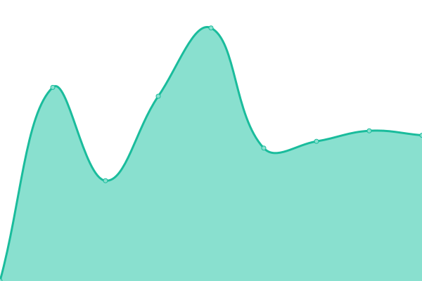
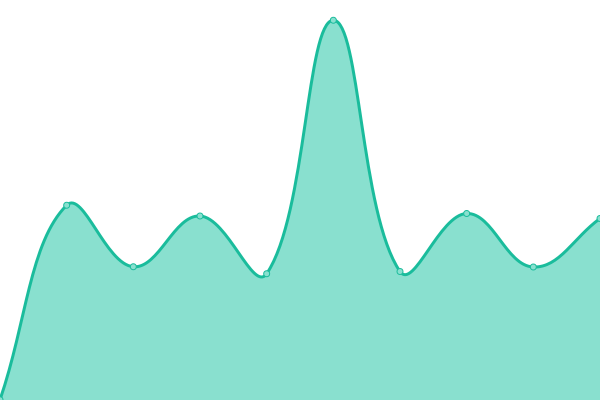
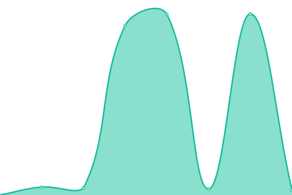

# [📈 Live Status](https://status.yukineko.me): <!--live status--> **🟩 All systems operational**

This repository contains the open-source uptime monitor and status page for [yukineko](https://yukineko.me), powered by [Upptime](https://github.com/upptime/upptime).

With [Upptime](https://upptime.js.org), you can get your own unlimited and free uptime monitor and status page, powered entirely by a GitHub repository. We use [Issues](https://github.com/hideki0403/status.yukineko.me/issues) as incident reports, [Actions](https://github.com/hideki0403/status.yukineko.me/actions) as uptime monitors, and [Pages](https://status.yukineko.me) for the status page.

<!--start: status pages-->
<!-- This summary is generated by Upptime (https://github.com/upptime/upptime) -->
<!-- Do not edit this manually, your changes will be overwritten -->
<!-- prettier-ignore -->
| URL | Status | History | Response Time | Uptime |
| --- | ------ | ------- | ------------- | ------ |
|  [Blog (ゆきねこの備忘録)](https://yukineko.me) | 🟩 Up | [blog.yml](https://github.com/hideki0403/status.yukineko.me/commits/HEAD/history/blog.yml) | 

 1513ms
     
 | 

<a href="https://status.yukineko.me/history/blog">96.31%</a>
    

|  [Misskey (隠れ家)](https://misskey.yukineko.me) | 🟩 Up | [misskey.yml](https://github.com/hideki0403/status.yukineko.me/commits/HEAD/history/misskey.yml) | 

 699ms
     
 | 

<a href="https://status.yukineko.me/history/misskey">96.32%</a>
    

|  [GitServer (Gitea)](https://git.yukineko.me) | 🟩 Up | [git-server-gitea.yml](https://github.com/hideki0403/status.yukineko.me/commits/HEAD/history/git-server-gitea.yml) | 

 634ms
     
 | 

<a href="https://status.yukineko.me/history/git-server-gitea">96.63%</a>
    

|  [Firefox Send (Selfhost)](https://send.yukineko.me) | 🟩 Up | [firefox-send-selfhost.yml](https://github.com/hideki0403/status.yukineko.me/commits/HEAD/history/firefox-send-selfhost.yml) | 

 618ms
     
 | 

<a href="https://status.yukineko.me/history/firefox-send-selfhost">96.65%</a>
    

|  EarthquakeEarlyWarningPlus | 🟩 Up | [earthquake-early-warning-plus.yml](https://github.com/hideki0403/status.yukineko.me/commits/HEAD/history/earthquake-early-warning-plus.yml) | 

 7915ms
     
 | 

<a href="https://status.yukineko.me/history/earthquake-early-warning-plus">99.14%</a>
    

<!--end: status pages-->

[**Visit our status website →**](https://status.yukineko.me)

## 📄 License

- Powered by: [Upptime](https://github.com/upptime/upptime)
- Code: [MIT](./LICENSE) © [yukineko](https://yukineko.me)
- Data in the `./history` directory: [Open Database License](https://opendatacommons.org/licenses/odbl/1-0/)
